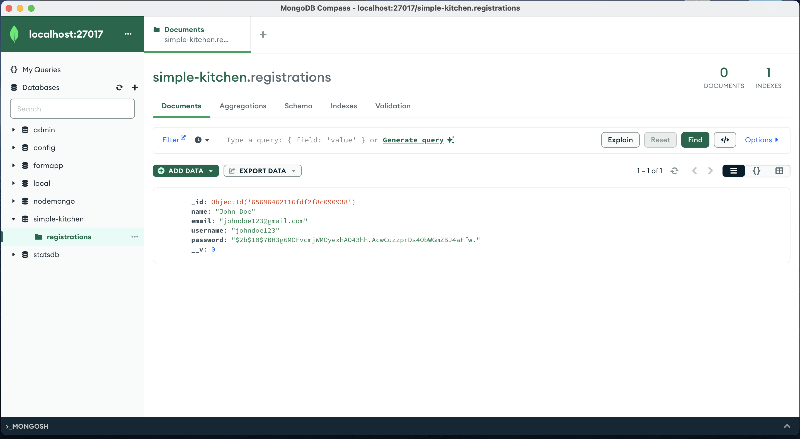

# web602-lab-week6

## Getting Started

*Always Keep `node_modules/` in `.gitignore`* and build the Express app freshly the first time you are working on it on your machine. If you are switching between devices, keeping `node_modules/` may result in permission issue, which prevents you from starting the app by `npm run watch`.

### Init
Run `npm init`.

This will generate a file `package.json` at project root.

Then at project root, create a `.env` file, in which will contain the database connection information.
```bash
DATABASE=mongodb://localhost:27017/simple-kitchen
```

### Dependencies
You can run `npm install <list of dependencies>` yourself, but here is the list, just for clarity.

- **For Build**
    - `npm install express`
    - `npm install --save-dev nodemon`

- **For the Application**
    - `npm install http-auth`
    - `npm install pug`
    - `npm install express-validator`
    - `npm install --save bcrypt`

- **For Database (MongoDB)**
    - `npm install mongoose`
    - `npm install dotenv`

- **For Stylesheet**
    - `npm install sass -g`

### Other Helpful Commands

- **To Generate `.css` files from `.scss` files**
    - `sass <path to scss file> <destination for css file>`


## Test
New fields "username" and "password" are added.

*(the password typed is "password")*

As the "Register" button is clicked, data is saved to MongoDB.

*(Notice that the password is hashed).*
